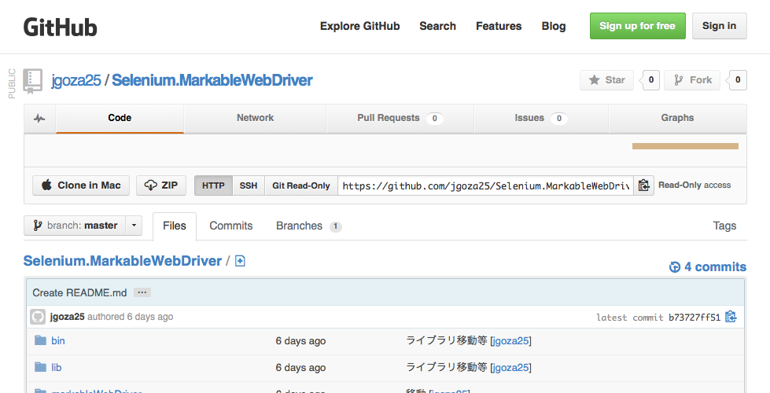
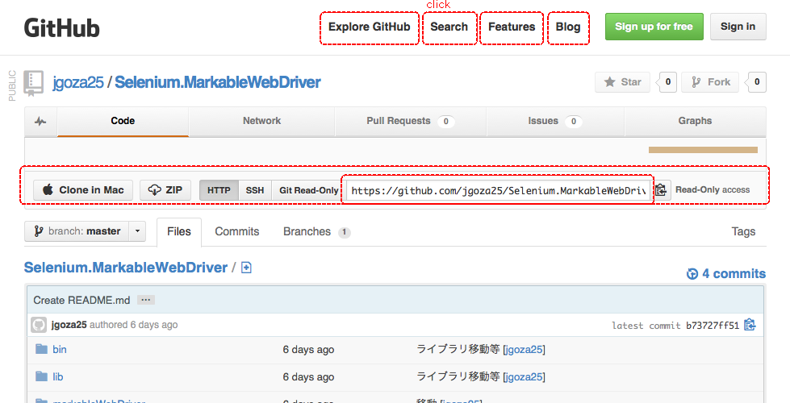

# 検証個所自動マーク付きWebDriver

SeleniumのWebDriverを拡張し、画面キャプチャ時に検証個所にマークを追加します。

**特徴**
* findElement(s)を実行した要素を自動的に赤線で囲み、画面キャプチャに出力します。
* WebDriverの生成処理を書き換えるだけで機能します。
* 要素に対してコメントの記述が可能です。

## ダウンロード

最新バージョン　[markableWebDriver_0.1.jar](http://tin.li/6qd)

## 使い方
WebDriverの生成箇所を下記のように書き換えます。
```java
		// WebDriver driver = new FirefoxDriver();
		WebDriver driver = new MarkableWebDriver(new FirefoxDriver());
```
TakesScreenshot使って画面キャプチャを取るとfindElement(s)した要素にマーキングが追加されます。

## サンプル実装
[Selenium2Example1Test.java](https://github.com/jgoza25/markableDriver/blob/master/example/org/jgoza25/selenium/example/Selenium2Example1Test.java)


## 適用前の画面キャプチャ


## 適用後の画面キャプチャ

findElement()している要素が赤線で囲まれてみやすくなっています。

## コメントの記載方法
画面キャプチャにコメントを残すことができます。
MarkableWebDriverを利用した場合、各要素は MarkableWebElement が
```java
((MarkableWebElement) element).addComment("コメントを記入");
```

