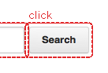

# 検証個所自動マーク付きWebDriver

SeleniumのWebDriverを拡張し、画面キャプチャ時に検証個所にマークを追加します。

**特徴**
* findElement(s)を実行した要素を自動的に赤線で囲み、画面キャプチャに出力します。
* WebDriverの生成処理を書き換えるだけで機能します。
* 要素に対してコメントの記述が可能です。

## ダウンロード

最新バージョン　[markableWebDriver_0.3.jar](https://github.com/jgoza25/markableDriver/raw/master/dist/markableWebDriver_0.3.jar)

## 使い方
WebDriverの生成箇所を下記のように書き換えます。
```java
		// WebDriver driver = new FirefoxDriver();
		WebDriver driver = new MarkableWebDriver(new FirefoxDriver());
```
TakesScreenshot使って画面キャプチャを取るとfindElement(s)した要素にマーキングが追加されます。
TakesScreenshotの使い方は後述しています。

## サンプル実装
[Selenium2Example1Test.java](https://github.com/jgoza25/markableDriver/blob/master/example/org/jgoza25/selenium/example/Selenium2Example1Test.java)


## 適用前の画面キャプチャ


## 適用後の画面キャプチャ

findElement()している要素が赤線で囲まれてみやすくなっています。

## 要素をマスクする
画面キャプチャの差分による検証を行う場合、現在時刻など外的要因によって
表示が変わってしまう要素が含まれてしまうと単純な画像比較による検証が行えません。
下記のコードにより要素をマスク（黒塗り）する事ができます。

```java
((MarkableWebElementImpl) element).mask();
```


## コメントの記載方法
画面キャプチャにコメントを残すことができます。
MarkableWebDriverを利用した場合、各要素は MarkableWebElement がインタフェースを実装していますので
addComment()メソッドを使ってコメントを書きます。
```java
((MarkableWebElement) element).addComment(click");
```

# Selenium2にて画面キャプチャを取得する（参考）
TakesScreenshotインタフェースを実装している場合、画面キャプチャを取得することができます。
下記のようにキャプチャ用のメソッドを用意しておくと便利です。

```java
	@Test
	public void test() throws Exception {
		// WebDriverを生成
		WebDriver driver = new FirefoxDriver();
		
		// 省略

		// 画面キャプチャを取得
		capture(driver, "res/01.png");
	}

	private void capture(WebDriver driver, String path) throws IOException {
		if (driver instanceof TakesScreenshot) {
			File file = ((TakesScreenshot) driver).getScreenshotAs(OutputType.FILE);
			FileUtils.copyFile(file, new File(path));
		}
	}
```
